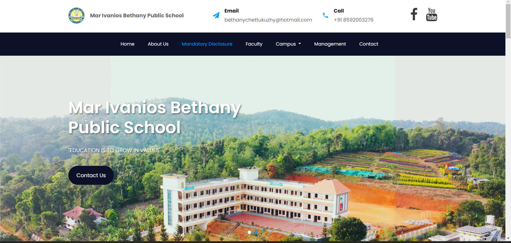
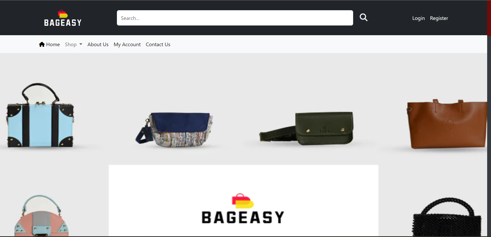

# 💫 About Me:
Hi there! 👋  I'm a **Python Full-Stack Developer** specializing in **Django** 🐍, with a passion for building dynamic web applications. Here's a bit more about me:

- 🎓 Currently pursuing my **MCA** at **Marian College, Kuttikkanam**
- 🎓 Graduated with a **Bachelor's degree in Physics** from **St. Berchmans College, Changanassery**
- ☁️ Aspiring **Cloud Engineer**, excited about cloud technologies and infrastructure
- 🤖 Worked on several **Natural Language Processing (NLP)** projects, exploring AI and machine learning
- 💻 Skilled in both **front-end** and **back-end development** with a focus on creating scalable, efficient apps
- 🔧 Always experimenting with new frameworks, tools, and contributing to open-source projects
- 💬 Let's collaborate on exciting projects, or feel free to reach out if you'd like to discuss tech, code, or anything in between!

---
## 💻 Tech Stack:
                                     
---

# 💼 Featured Projects

<table>
  <tr>
    <td width="50%">
      <h3 align="center">MIBPS School Website 📚</h3>
      

        
         
         
        

          
        

        
<strong>Django, AWS EC2, Nginx, SQLite, DRF</strong>

        

          🔒 SSL configured with Certbot 
          🚀 Hosted on AWS EC2 with Nginx 
          🔍 SEO optimized 
          📱 Responsive design with Bootstrap
        

      

    </td>
    <td width="50%">
      <h3 align="center">EngLearn - English Learning Platform 📖</h3>
      

        
         
         
        

          
        

        
<strong>Python, Django, PostgreSQL, NLP, Gemini API</strong>

        

          🤖 AI Tutor with Gemini API 
          ✍️ Grammar and Spell Checkers using NLP 
          📊 Interactive lessons and quizzes 
          🎨 Responsive UI with Bootstrap
        

      

    </td>
  </tr>
  <tr>
    <td width="50%">
      <h3 align="center">SkinLuxe E-commerce Website 🛍️</h3>
      

        
         
         
        

          
        

        
<strong>Django, JavaScript, Chart.js, Bootstrap</strong>

        

          📊 Real-time analytics with Chart.js 
          🧴 Specialized in skincare products 
          📱 Mobile-first responsive design 
          🛒 Full e-commerce functionality
        

      

    </td>
    <td width="50%">
      <h3 align="center">BagEasy 👜</h3>
      

        
         
         
        

          
        

        
<strong>Django, JavaScript, PostgreSQL, Bootstrap</strong>

        

          🛍️ Clone of BagEasy online store 
          🖼️ Dynamic product catalog 
          🛒 Full shopping cart functionality 
          📱 Responsive design for all devices
        

      

    </td>
  </tr>
</table>

## 🌐 Connect with Me:
 
 

## 📊 GitHub Stats:
 

## 🔝 Top Contributed Repo

---

